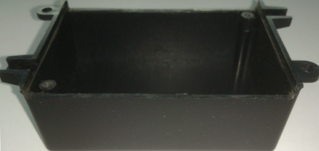
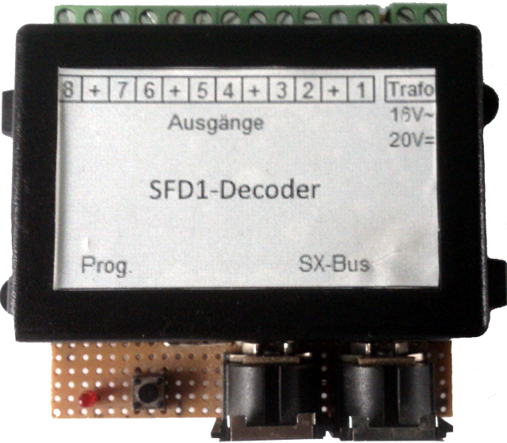

Dieser Ordner enthält die Eagle Dateien

Die DIN-Stecker Version ist eine einseitige Platine

Es existiert ein <a href="https://www.reichelt.de/my/1683631">Reichel Warenkorb</a>. Die Teileliste ist für beide Versionen gültig. Die nicht benötigten Teile müssen dann gelöscht werden.

Das Gehäuseoberteil muss an den Längsseiten um 4mm gekürzt werden. Die Schraubendome müssen auf dieses Niveau abgefeilt werden. Die Platine wird dann zwischen beide Gehäusehälften eingeklemmt.

Das Bild zeigt noch den Prototyp mit Lochstreifenplatine.
